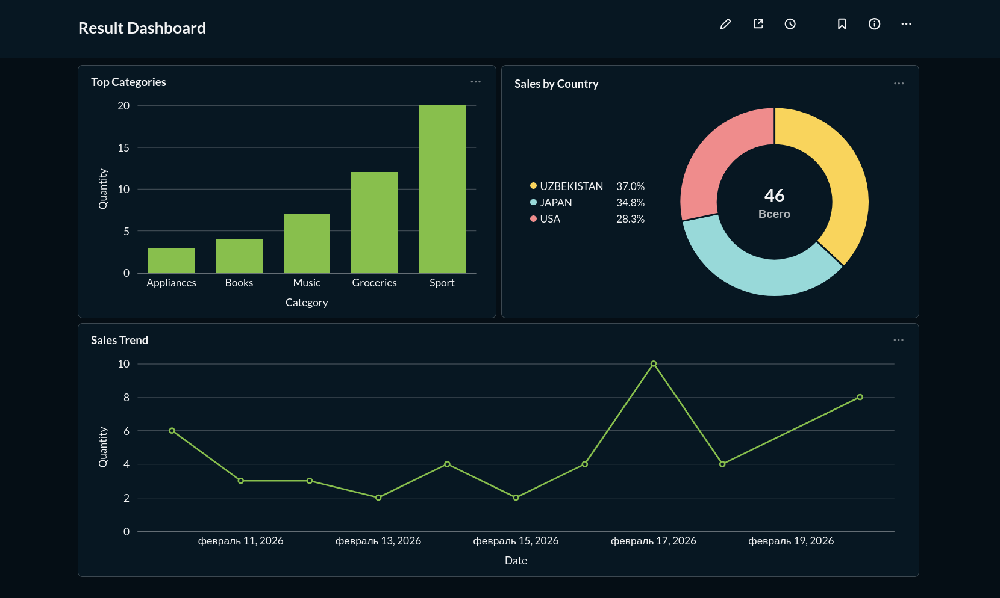

[](README.md)

# Хранилище данных  и ETL-пайплайн

## Описание проекта

Этот проект извлекает сырые данные из оперативной базы данных, обрабатывает их через транзитные слои и загружает в хранилище данных для бизнес-аналитики и построения отчетов. Вся инфраструктура полностью контейнеризирована с использованием Docker Compose.

### Стек технологий

-   **База данных:** PostgreSQL 15
    
-   **Управление:** Apache Airflow 2.8
    
-   **Визуализация:** Metabase
    
-   **Инфраструктура:** Docker, Docker Compose
    
-   **Языки:** Python 3, SQL, Bash
    

----------

## Архитектура и ключевые решения

### 1. Логическое разделение через схемы (Schemas)

Архитектура использует логические схемы (mrr, stg, dwh) внутри единой базы данных DWH.

-    Создание отдельных физических баз данных в Postgres требует использования расширения postgres_fdw для кросс-базовых запросов, что увеличивает сетевую нагрузку и снижает производительность. Использование схем обеспечивает четкое логическое разделение слоев, позволяя при этом выполнять высокоскоростные нативные SQL-трансформации.
    

### 2. Инкрементальная загрузка и Идемпотентность

-   Данные извлекаются из базы-источника в слой MRR с использованием метода **High Water Mark**. В Airflow `PythonOperator` обращается к таблице `dwh.high_water_mark` и забирает из источника только новые или обновленные записи о продажах.
    
-   Транзитные слои (`mrr`, `stg`) строго очищаются в начале каждого запуска для предотвращения дублирования данных.
    
-   Финальная загрузка в слой DWH использует 
`INSERT ... ON CONFLICT DO UPDATE`, что гарантирует идемпотентность и позволяет безопасно перезапускать пайплайн в любой момент.
    

### 3. Качество данных

Для контроля целостности данных на этапе STG реализован паттерн Dead Letter Queue (DLQ).

-    Невалидные записи (например, продажи с отрицательным или нулевым количеством qty <= 0) не удаляются бесследно. Они перенаправляются в специальную таблицу stg.rejected_sales для последующего аудита, что гарантирует отсутствие скрытых потерь транзакций.
    

### 4. Обработчики событий и Логирование

Для мониторинга пайплайнов и обработки событий используются стандартные механизмы экосистемы Airflow — Callbacks (on_success_callback, on_failure_callback).

-    Если DAG падает с ошибкой, функция-коллбек перехватывает исключение Python и записывает точный текст ошибки, временную метку и статус напрямую в служебную таблицу dwh.etl_logs для удобного дебага.
    

### 5. Независимость от BI-платформы

Схема "Звезда" (Star Schema) полностью реализована на уровне DWH, что делает модель данных универсальной и независимой от конкретного BI-инструмента.

-    В качестве легковесного решения для визуализации выбран Metabase, который развернут непосредственно в общей сети Docker. Это обеспечивает автономность аналитической среды и позволяет избежать сложных лицензионных ограничений при развертывании инфраструктуры.

----------

## Как запустить проект

### Шаг 1: Запуск инфраструктуры

Склонируйте репозиторий и запустите Docker-контейнеры. Скрипты инициализации (`init_source.sql` и `init_dwh.sql`) автоматически монтируются и выполняются в Postgres при старте.

Запущенные сервисы: `pg_source` (5432), `pg_dwh` (5433), `airflow` (8080), `metabase` (3000).

### Шаг 2: Настройка подключений Airflow

1.  Откройте интерфейс Airflow: http://localhost:8080 (Учетные данные: `admin` / `admin`).
    
2.  Перейдите в **Admin -> Connections** и добавьте два подключения Postgres:
    

**Conn Id:** `pg_source_conn`

-   **Host:** `pg_source`
    
-   **Port:** `5432`
    
-   **Schema:** `operational_db`
    
-   **Login:** `admin`
    
-   **Password:** `password`
    

**Conn Id:** `pg_dwh_conn`

-   **Host:** `pg_dwh`
    
-   **Port:** `5432`
    
-   **Schema:** `data_warehouse`
    
-   **Login:** `admin`
    
-   **Password:** `password`
    

### Шаг 3: Запуск ETL-пайплайна

1.  В интерфейсе Airflow найдите DAG `mrr_stg_dwh_pipeline`.
    
2.  Снимите DAG с паузы и запустите его вручную.
    
3.  После завершения работы пайплайна вы можете проверить логи выполнения в базе данных:

SQL

```
SELECT * FROM dwh.etl_logs ORDER BY execution_time DESC;
```
    

### Шаг 4: Бизнес-логика и хранимая процедура

Хранимая процедура использует явные курсоры и блок `TRY/CATCH` для расчета бонусных баллов лояльности на основе количества покупок и обновляет таблицу фактов. Чтобы протестировать её работу, выполните эту SQL-команду в базе данных `pg_dwh`:

SQL

```
CALL dwh.process_sales_loyalty();
```

### Шаг 5: Просмотр дашборда

1.  Откройте Metabase: http://localhost:3000.
    
2.  Подключите его к базе данных `pg_dwh` (Host: `pg_dwh`, Port: `5432`, Database: `data_warehouse`).
    
3.  Постройте дашборды, используя таблицы из схемы `dwh`.
    

----------

## Скриншоты

### Дашборд (пример)


